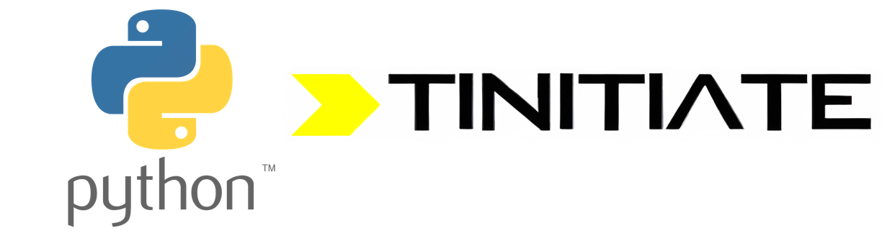

# Python Interview QnA
&copy; TINITIATE.COM

##### [Back To Contents](./README.md)

# Python Functions

## Q1. What is a function in Python?
**Answer:**  
A function is a reusable block of code that performs a specific task, defined using `def`.

## Q2. How do you define a function?
**Answer:**  
```python
def greet():
    print("Hello")
```

## Q3. How do you call a function?
**Answer:**  
By using its name followed by parentheses.  
```python
greet()
```

## Q4. What is the scope of variables in functions?
**Answer:**  
- Local → defined inside function.  
- Global → defined outside function.  
- Python follows LEGB rule: Local → Enclosing → Global → Built-in.

## Q5. How do you pass arguments to a function?
**Answer:**  
By specifying them in parentheses.  
```python
def add(a,b): return a+b
print(add(2,3))
```

## Q6. What are positional arguments?
**Answer:**  
Arguments passed in the same order as parameters.  
```python
def f(a,b): print(a,b)
f(1,2)
```

## Q7. What are keyword arguments?
**Answer:**  
Arguments passed with parameter names.  
```python
def f(a,b): print(a,b)
f(b=2, a=1)
```

## Q8. What are default arguments?
**Answer:**  
Parameters with default values.  
```python
def greet(name="Guest"): print("Hello", name)
greet()
```

## Q9. What are variable-length arguments?
**Answer:**  
- `*args` → multiple positional args  
- `**kwargs` → multiple keyword args  
```python
def demo(*args, **kwargs): print(args, kwargs)
demo(1,2,x=3)
```

## Q10. What are lambda functions?
**Answer:**  
Anonymous single-expression functions.  
```python
f = lambda x: x*x
print(f(5))
```

## Q11. What is the difference between return and print?
**Answer:**  
- `return`: Sends value back to caller.  
- `print`: Displays output on console.

## Q12. Can functions return multiple values?
**Answer:**  
Yes, as tuples.  
```python
def stats(x,y): return x+y, x*y
s,p = stats(2,3)
```

## Q13. What are recursive functions?
**Answer:**  
Functions that call themselves.  
```python
def fact(n): return 1 if n==0 else n*fact(n-1)
```

## Q14. What is the difference between pass by value and pass by reference?
**Answer:**  
- Immutable objects (int, str, tuple) → behave like pass by value.  
- Mutable objects (list, dict) → behave like pass by reference.

## Q15. What is a docstring in a function?
**Answer:**  
A string literal at the beginning of a function, used for documentation.  
```python
def f(): """This is a docstring"""
```

## Q16. How do you access function annotations?
**Answer:**  
Annotations are stored in `__annotations__`.  
```python
def f(x:int)->str: return str(x)
print(f.__annotations__)
```

## Q17. What is a higher-order function?
**Answer:**  
A function that takes another function as argument or returns a function.  
```python
def apply(fn,x): return fn(x)
print(apply(lambda n:n*n,5))
```

## Q18. What are built-in higher-order functions in Python?
**Answer:**  
`map()`, `filter()`, `reduce()`, `sorted()` with `key`.

## Q19. What is the difference between normal functions and lambda functions?
**Answer:**  
- Normal → multiline, named, reusable.  
- Lambda → single-line, anonymous, used inline.

## Q20. What are common use cases of functions?
**Answer:**  
- Code reusability  
- Abstraction  
- Modular programming  
- Functional programming style

##### [Back To Contents](./README.md)
***
| &copy; TINITIATE.COM |
|----------------------|
